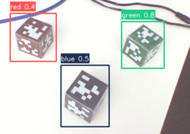
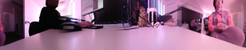
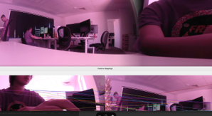

# 🎯 Repository Goals

The repository consists of five independent workspaces, each covering an essential aspect of robotic perception and vision. The aim is to:

- 📚 Build a strong foundation in camera calibration.
- 🔄 Understand multi-sensor calibration and sensor fusion.
- 🤖 Explore perception pipelines for robotics.
- 🧪 Provide reusable ROS workspaces for experimentation.
- 🚀 Serve as a reference for future robotics and computer vision projects.

---

# 📷 Camera Calibration

This workspace introduces the fundamentals of **camera calibration** in **ROS 2 Humble**, including camera setup, image acquisition, image rectification, and the estimation of intrinsic and extrinsic camera parameters.

---

## 📦 Prerequisites

Install the required ROS 2 packages:

```bash
sudo apt update

sudo apt install ros-humble-image-pipeline
sudo apt install ros-humble-v4l2-camera
```

---

## 🔍 Detect Connected Cameras

Before launching the camera, verify that your system detects the connected devices.

List all available video devices:

```bash
ls /dev/video*
```

Display detailed camera information:

```bash
v4l2-ctl --list-devices
```

Example output:

```text
USB Camera:
    /dev/video0
    /dev/video1
```

---

## ▶️ Launch a Single Camera

Start a camera node using the desired video device.

```bash
ros2 run v4l2_camera v4l2_camera_node \
  --ros-args -p video_device:=/dev/video2
```

> **Note:** Replace `/dev/video2` with the correct camera device on your system.

---

## 🚀 Launch Using a ROS 2 Launch File

For projects involving image processing and calibration, it is recommended to use a launch file to start multiple nodes simultaneously.

### Example Launch File

```python
from launch import LaunchDescription
from launch_ros.actions import Node


def generate_launch_description():
    return LaunchDescription([

        # Camera Node
        Node(
            package='v4l2_camera',
            executable='v4l2_camera_node',
            name='camera_node',
            parameters=[
                {'video_device': '/dev/video0'},
                {
                    'camera_info_url':
                    'file:///home/<username>/.ros/camera_info/left_camera.yaml'
                }
            ],
            remappings=[
                ('/image_raw', '/camera_1/image_raw'),
                ('/camera_info', '/camera_1/camera_info')
            ],
        ),

        # Image Processing Node
        Node(
            package='image_proc',
            executable='image_proc',
            name='image_proc_node_1',
            remappings=[
                ('/image', '/camera_1/image_raw'),
                ('/camera_info', '/camera_1/camera_info'),
                ('/image_rect', '/camera_1/image_rect'),
            ]
        ),
    ])
```

> **Note:** Replace `<username>` with your own Linux username.

---

## 📖 Launch File Components

| Component | Description |
|-----------|-------------|
| `v4l2_camera_node` | Captures images from the USB camera. |
| `video_device` | Specifies which camera device to use (e.g., `/dev/video0`). |
| `camera_info_url` | Loads the calibration YAML file for the camera. |
| `image_proc` | Rectifies images using the camera calibration parameters. |
| Topic Remapping | Publishes images and camera information under custom topic names. |

---

## ▶️ Build and Launch

Build the workspace:

```bash
colcon build
```

Source the workspace:

```bash
source install/setup.bash
```

Launch the camera:

```bash
ros2 launch <your_package_name> camera.launch.py
```

Replace `<your_package_name>` with the package containing the launch file.

---

## 📡 Published Topics

| Topic | Description |
|--------|-------------|
| `/camera_1/image_raw` | Raw image stream |
| `/camera_1/camera_info` | Camera calibration parameters |
| `/camera_1/image_rect` | Rectified image after calibration |

---

# 📡 LiDAR Calibration

This workspace demonstrates how to set up a **Velodyne LiDAR** in **ROS 2 Humble**, visualize point cloud data, and perform **camera-LiDAR calibration** using the `ros2_camera_lidar_fusion` package.

---

## 📦 Prerequisites

Install the required Velodyne ROS 2 packages:

```bash
sudo apt update

sudo apt install ros-humble-velodyne
```

---

## 🚀 Launch the Velodyne Driver

Start the Velodyne driver node:

```bash
ros2 launch velodyne_driver velodyne_driver_node-VLP32C-launch.py
```

Launch the point cloud transformation node:

```bash
ros2 launch velodyne_pointcloud velodyne_transform_node-VLP32C-launch.py
```

Visualize the LiDAR point cloud in RViz2:

```bash
ros2 run rviz2 rviz2 --fixed-frame velodyne
```

> **Note:** Ensure your LiDAR is connected and configured correctly before launching the nodes.

---

## 🔗 Camera-LiDAR Calibration

This project uses the **ROS 2 Camera-LiDAR Fusion** package developed by CDonosoK.

Repository:

👉 https://github.com/CDonosoK/ros2_camera_lidar_fusion

Follow the installation and calibration instructions provided in the repository.

---

## 🐳 Docker Configuration

If you are using the provided Docker environment, update the `Dockerfile` by installing the additional ROS packages below.

Add the following section:

```dockerfile
RUN apt-get install -y \
    ros-${ROS_DISTRO}-pcl-ros \
    ros-${ROS_DISTRO}-pcl-conversions \
    ros-${ROS_DISTRO}-cv-bridge \
    ros-${ROS_DISTRO}-v4l2-camera \
    ros-${ROS_DISTRO}-rviz2 \
    ros-${ROS_DISTRO}-velodyne
```

Rebuild the Docker image after modifying the Dockerfile.

---

## 📖 Package Overview

| Package | Purpose |
|----------|---------|
| `velodyne_driver` | Receives packets from the Velodyne LiDAR. |
| `velodyne_pointcloud` | Converts raw packets into ROS point clouds. |
| `rviz2` | Visualizes the generated point cloud. |
| `ros2_camera_lidar_fusion` | Performs camera-LiDAR calibration and sensor fusion. |

---

# 🤖 YOLOv8 Object Detection

This workspace demonstrates how to set up, train, and evaluate **YOLOv8** models for object detection. It includes dataset preparation, model training, inference, and visualization using Python.




*Figure: Object detection result using the trained YOLOv8 model.*

---

## 📦 Prerequisites

Follow the instructions provided in the project GitHub repository.

If `pip` is not already installed, install it using:

```bash
sudo apt update

sudo apt install python3-pip
```

---

## 📥 Install YOLOv8

Install the required Python packages:

```bash
pip install ultralytics opencv-python numpy
```

Add the local Python binaries to your system `PATH`:

```bash
echo 'export PATH=$HOME/.local/bin:$PATH' >> ~/.bashrc
source ~/.bashrc
```

Verify the installation:

```bash
yolo --help
```

---

# 📂 Dataset Structure

Organize your dataset using the following directory structure:

```text
project/
├── train/
│   ├── images/      # Training images
│   └── labels/      # YOLO annotation files
├── val/
│   ├── images/      # Validation images
│   └── labels/      # YOLO annotation files
```

Each image should have a corresponding `.txt` annotation file using the YOLO annotation format.

---

# 📝 Configure the Dataset

Create a `project.yaml` file containing your dataset information.

Example:

```yaml
path: ./project

train: train/images
val: val/images

names:
  0: person
  1: bottle
  2: chair
```

> **Note:** Update the `names` section to match the number and names of your object classes.

---

# 📷 Capture Training Images

Use the provided `camera.py` script to collect images for your dataset.

The script allows you to:

- 📸 Capture images directly from a webcam.
- 💾 Save images into the training dataset.
- 🗂️ Build a custom dataset for object detection.

---

# 🚀 Train the Model

Run the training script provided in this workspace.

Example command:

```bash
python train.py
```

The training script will:

- Load the dataset from `project.yaml`
- Train a YOLOv8 model
- Save the trained weights
- Display training metrics

---

# 🔍 Run Inference

After training is complete, run the inference script to detect objects.

```bash
python detect.py
```

The script will:

- Load the trained YOLOv8 model
- Detect objects in images or video
- Display bounding boxes and confidence scores
- Visualize the detection results

---

# 📁 Workspace Files

| File | Description |
|------|-------------|
| `camera.py` | Capture images from a webcam for dataset creation. |
| `project.yaml` | Dataset configuration file. |
| `train.py` | Train a custom YOLOv8 model. |
| `detect.py` | Perform inference using the trained model. |

---

# 🌍 360° Camera Processing

This workspace explores **360-degree camera processing** techniques, including panoramic image generation, image stitching, and stabilization methods for creating seamless wide-angle views.

The workspace focuses on two main approaches:

- **Blended Solution** – Combining multiple camera views to create a continuous panoramic image.
- **Image Stitching Solution** – Using feature detection and geometric transformations to align and merge images.

---

# 🧩 Blended Solution

## 🎯 Objective

Implement a blending-based approach for processing images captured from a 360° camera system.

The goal is to combine overlapping camera views smoothly while minimizing visible seams between images.


---

## 🔍 Stitching Pipeline

The stitching process consists of the following steps:

### 1. 📌 Feature Detection (SIFT)

**Scale-Invariant Feature Transform (SIFT)** is used to detect and describe key points between overlapping images.

This allows the system to identify common features across multiple camera frames.

---

### 2. 🔗 Feature Matching

Detected features are matched between images to determine corresponding points.

The matched features are used to estimate the relationship between camera views.

---

### 3. 📐 Homography Estimation

A homography matrix is calculated to transform one image plane into another.

This allows images captured from different viewpoints to be aligned correctly.

---

### 4. 🛠️ Stabilisation

Homography stabilization is applied to reduce image movement and improve panorama consistency.

This helps produce smoother and more stable panoramic outputs.

---



*Figure: Example panoramic output generated from 360° camera processing using blended solution.*



*Figure: Example panoramic output generated from 360° camera processing using SIFT and homography stabilisation.*
